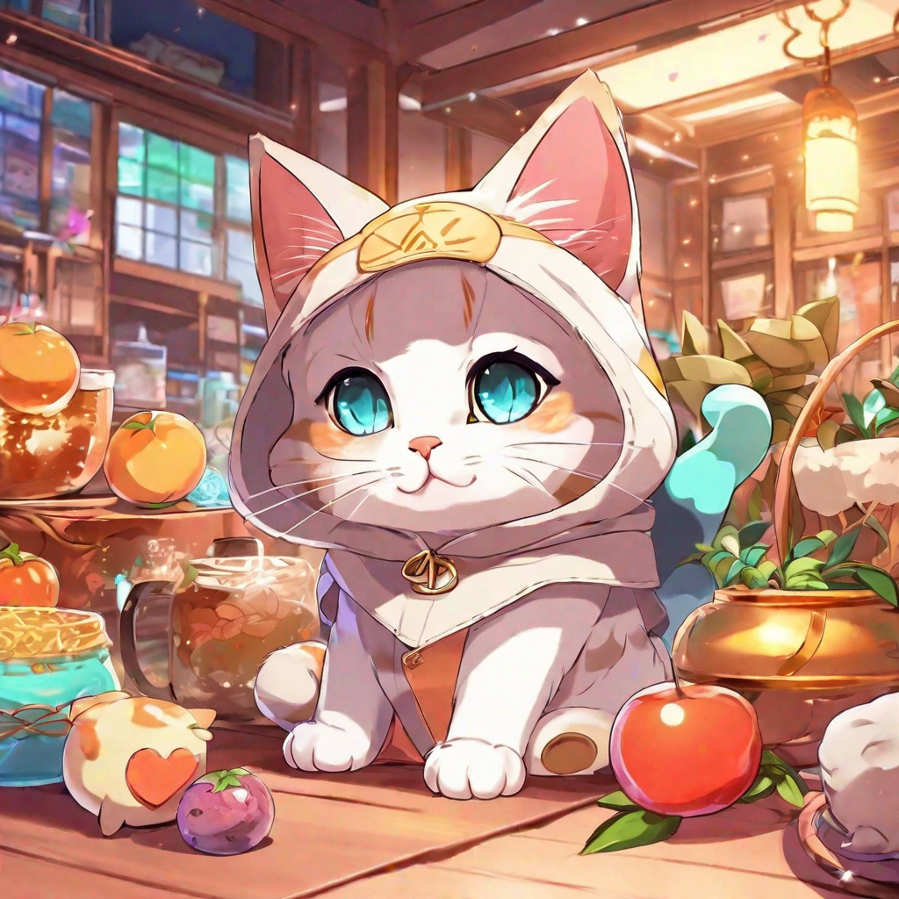
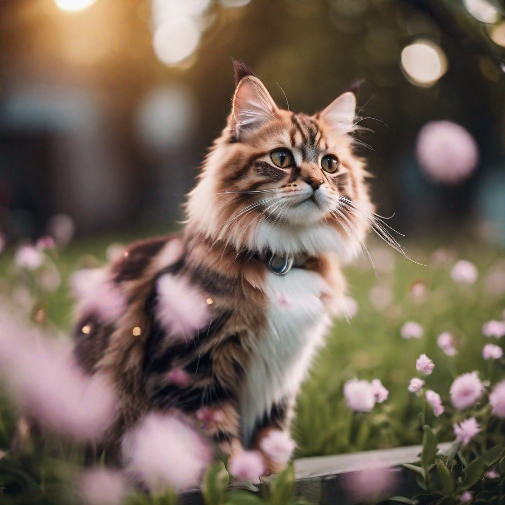
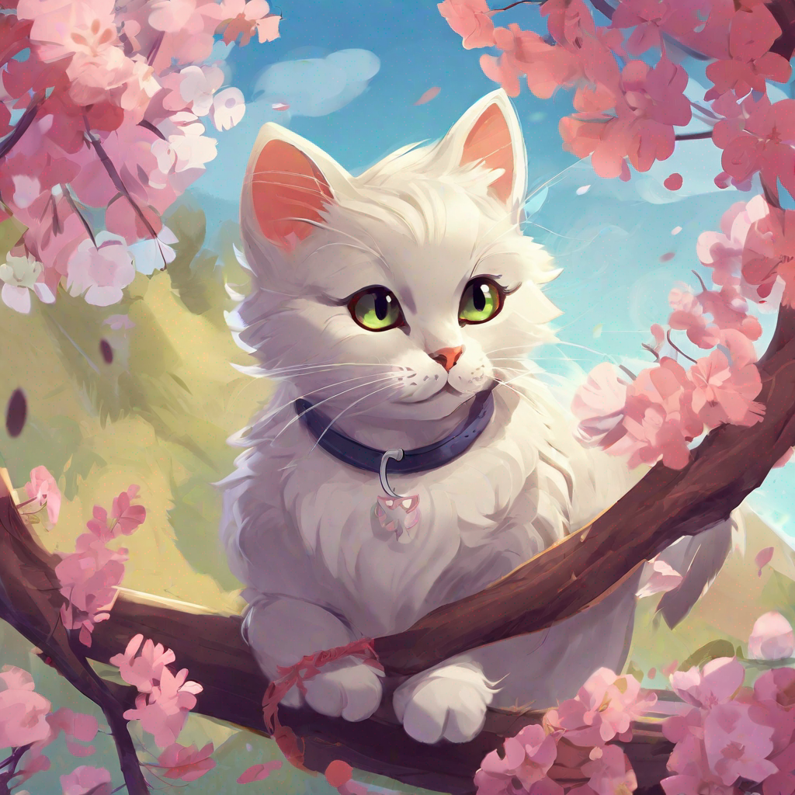

# AI Image Generator Chat 🎨🤖

This project is an AI-powered image generator chat application that allows users to interactively generate images based on prompts. It leverages the MonsterAPI for text-to-image generation using various styles.

## Features

- **User-Friendly Interface:** Simple and intuitive interface for generating images.
- **Style Selection:** Choose from a variety of styles for image generation.
- **Multiple Images:** Generate multiple images in one command.
- **Download Images:** Download generated images to your device.
- **Full-Screen Preview:** Double-click on an image to view it in full-screen mode.

## Usage

1. Enter your desired command or prompt in the input field.
2. Choose a style from the dropdown menu (optional).
3. Specify the number of images to generate (optional).
4. Click the "Generate" button to initiate image generation.
5. Explore and download the generated images.

## Available Styles 🎨
### prompt: "A cute cat"

- **Anime Style** 🐱
  

- **Enhance Style** ✨
  

- **Photographic Style** 📸
  

- **Digital Art Style** 🎨
  

- **3D Model Style** 🚀
  

- and more...

## Project Structure

The project follows a simple structure with HTML, CSS, and JavaScript files:

- **index.html:** Defines the structure of the web page.
- **style.css:** Contains the styles for the application.
- **index.js:** Handles the initial setup of the page.
- **script.js:** Implements the core functionality of the image generation chat.

## Dependencies

- **MonsterAPI:** Used for text-to-image generation. API keys are required and can be configured in the script.

## Installation

1. Clone the repository.
2. Open the `index.html` file in a web browser.

## Contributing

Contributions are welcome! Feel free to open issues or submit pull requests.

## Acknowledgments

- Special thanks to [Eng. Mohamed Atif](https://github.com/m7md3atef) for creating this project 🤣.

---

**Made with ❤ by [Eng. Mohamed Atif](https://github.com/m7md3atef)**

